<picture>
    <source media="(prefers-color-scheme: dark)" srcset="images/microchip_logo_white_red.png">
    <source media="(prefers-color-scheme: light)" srcset="images/microchip_logo_black_red.png">
    
</picture>

## Hall Sensor-based Trapezoidal Commutation for BLDC Motor with Hall Sequence Identifier : MCLV-48V-300W and dsPIC33AK512MC510 Motor Control DIM

## 1. INTRODUCTION
This document describes the setup requirements for driving a Brushless DC (BLDC) Motor using trapezoidal commutation with Hall Sensor feedback and a Hall sequence identifier on the hardware platform [EV18H47A](https://www.microchip.com/en-us/development-tool/ev18h47a) "MCLV-48V-300W Development Board"  and [EV67N21A](https://www.microchip.com/en-us/development-tool/ev67n21a) "dsPIC33AK512MC510 Motor Control Dual In-line Module (DIM)".

For details about trapezoidal commutation of BLDC motor using Hall Sensor feedback, refer to Microchip application note [AN957](https://ww1.microchip.com/downloads/aemDocuments/documents/OTH/ApplicationNotes/ApplicationNotes/BLDCMC00957a.pdf) “Sensored BLDC Motor Control”. The Hall sequence identifier detects correct sequences of Hall and phase connections, allowing users the flexibility to connect Hall and phase wires in any order.

This application utilizes the Configurable Logic Cell (CLC) module of the dsPIC Digital Signal Controllers (DSCs) to detect changes in the Hall sensor sector, while utilizing the input capture feature of the Capture/Compare/PWM (CCP) peripheral to accurately measure time intervals for speed calculation. A simplified logic circuit and its truth table are provided below. For more detailed information, please refer to section [7 Appendix](#7-appendix).
     

     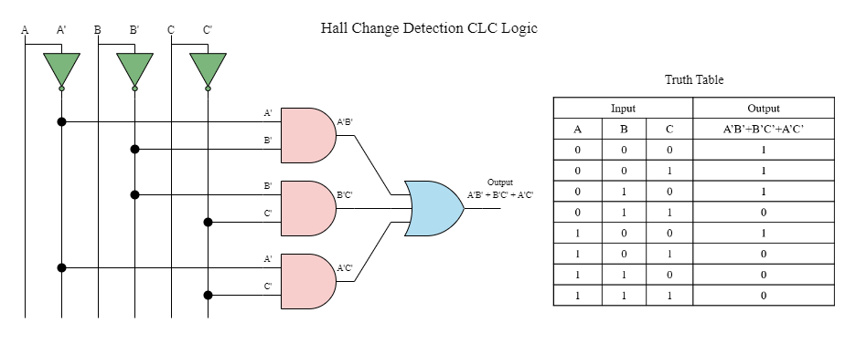

Enhance your embedded applications with Microchip's high-performance [dsPIC® Digital Signal Controllers (DSCs)](https://www.microchip.com/en-us/products/microcontrollers-and-microprocessors/dspic-dscs). Visit our [Motor Control and Drive page](https://www.microchip.com/en-us/solutions/technologies/motor-control-and-drive) to stay updated on the latest motor control solutions from Microchip.

> **Note:**  
>The [dsPIC33AK512MC510](https://www.microchip.com/en-us/product/dsPIC33AK512MC510) is a Digital Signal Controller (DSC) from Microchip Technology and part of the [dsPIC33AK512MPS512](https://www.microchip.com/en-us/product/dsPIC33AK512MPS512) family, designed for motor control and other high-performance embedded system applications.
 

## 2. SUGGESTED DEMONSTRATION REQUIREMENTS

### 2.1 Motor Control Application Firmware Required for the Demonstration

To clone or download this application firmware on GitHub, 
- Navigate to the [main page of this repository](https://github.com/microchip-pic-avr-solutions/mclv48v300w-33ak512mc510-bldc-an957-trapezoidal-hall-identifier) and 
- On the tab **<> Code**, above the list of files in the right-hand corner, click Code, then from the menu, click **Download ZIP** or copy the repository URL to **clone.**
> **Note:**  
>In this document, hereinafter this firmware package is referred as **firmware.**
### 2.2 Software Tools Used for Testing the firmware

- MPLAB® X IDE **v6.25** 
- Device Family Pack (DFP): **dsPIC33AK-MC_DFP v1.2.125**
- Curiosity/Starter Kits Tool Pack : **PKOB4_TP v1.19.1503**
- MPLAB® XC-DSC Compiler **v3.21**
- MPLAB® X IDE Plugin: **X2C-Scope v1.7.0** 
> **Note:**  
>The software used for testing the firmware prior to release is listed above. It is recommended to use these or later versions of the tool for building the firmware. All previous versions of Device Family Packs (DFP) and Tool Packs can be downloaded from [Microchip Packs Repository.](https://packs.download.microchip.com/)
### 2.3 Hardware Tools Required for the Demonstration
- MCLV-48V-300W Development Board [(EV18H47A)](https://www.microchip.com/en-us/development-tool/ev18h47a)
- dsPIC33AK512MC510 Motor Control Dual In-line Module [(EV67N21A)](https://www.microchip.com/en-us/development-tool/ev67n21a)
- 24V Power Supply [(AC002013)](https://www.microchipdirect.com/dev-tools/AC002013)
- 24V 3-Phase Brushless DC Motor - Hurst DMA0204024B101 [(AC300022)](https://www.microchip.com/en-us/development-tool/AC300022) or,
- 24V 3-Phase Brushless DC Motor - Hurst DMB0224C10002 [(AC300020)](https://www.microchip.com/en-us/development-tool/AC300020) or,
- 24V 3-Phase Brushless DC Motor - ACT 57BLF02 [(57BLF02)](https://www.act-motor.com/brushless-dc-motor-57blf-product/) or,
- 24V 3-Phase Leadshine Servo Motor [(ELVM6020V24FH-B25-HD)](https://www.leadshine.com/product-detail/ELVM6020V24FH-B25-HD.html)
> **Note:**  
> All items listed above except Leadshine Servo Motor (ELVM6020V24FH-B25-HD) and ACT Brushless DC Motor (57BLF02) are available at [microchip DIRECT](https://www.microchipdirect.com/)
>- Hurst DMA0204024B101(AC300022) is referred as Hurst300 or Long Hurst in the firmware
>- Hurst DMB0224C10002(AC300020) is referred as Hurst075 or Short Hurst in the firmware
>- ACT Brushless DC Motor 57BLF02 is referred as ACT02 in the firmware
>- Leadshine Servo Motor ELVM6020V24FH-B25-HD is referred as leadshine24v in the firmware
 

## 3. HARDWARE SETUP
This section describes the hardware setup required for the demonstration.
> **Note:**  
>In this document, hereinafter the MCLV-48V-300W Development Board is referred as **development board**. Refer the [MCLV-48V-300W Inverter Board User's Guide](https://ww1.microchip.com/downloads/aemDocuments/documents/MCU16/ProductDocuments/UserGuides/Motor-Control-Low-Voltage-48V-300W-Inverter-Board-Users-Guide-DS50003297.pdf) for more information about the development board.

1. Motor currents are amplified on the MCLV-48V-300W development board; it can also be amplified by the amplifiers internal to the dsPIC33AK512MC510 on the DIM. The firmware and DIM are configured to sample and convert internal amplifier outputs (**'internal op-amp configuration'**) by default to measure the motor currents. **Table-1** summarizes the resistors to be populated and removed to convert the DIM from **‘internal op-amp configuration’** to **‘external op-amp configuration’** or vice versa.

     

     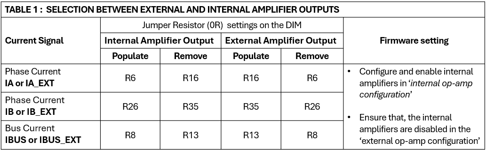

2. Insert the **dsPIC33AK512MC510 Motor Control DIM** into the DIM Interface **connector J8** on the development board. Make sure the DIM is placed correctly and oriented before going ahead.

     

     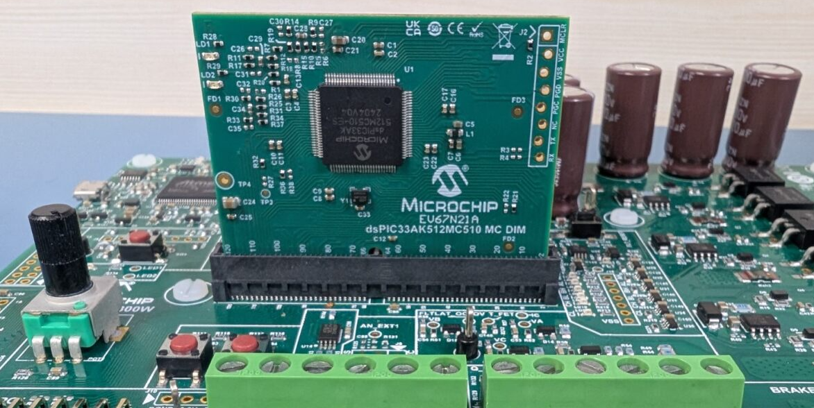

3. Connect the 3-phase motor wires to PHA, PHB, and PHC of the **connector J4** provided on the development board, **in any order**. 
     

      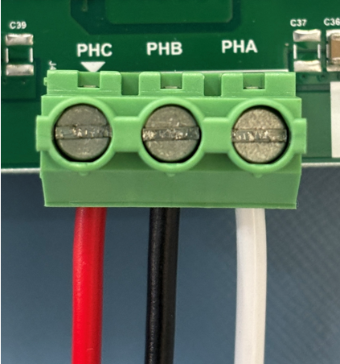

4. Connect the hall sensor's supply and ground wires to the Supply and Ground terminals of **connector J5** on the development board(see the figure). Then, **in any order**, connect the motor's hall sensor wires to the HA, HB, and HC of the **connector J5** provided on the development board.
     

      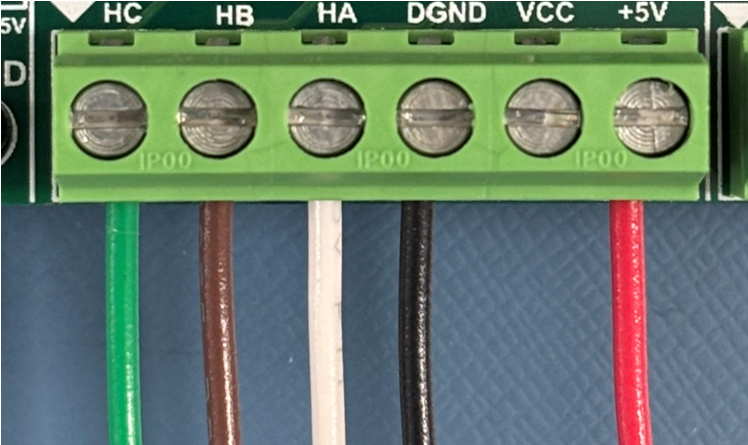

5. Plug the 24V power supply to **connector J1** on the development board. Alternatively, the development board can also be powered through connector J3.
      

      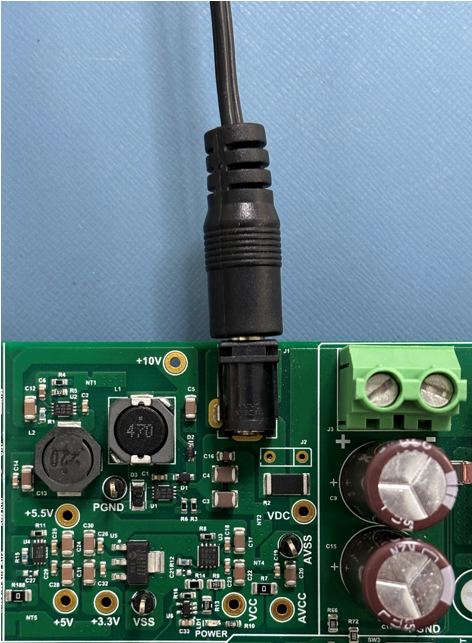

 

 6. The board has an onboard programmer **PICkit™ On Board (PKoBv4)** , which can be used for programming or debugging the microcontroller or dsPIC DSC on the DIM. To use the onboard programmer, connect a micro-USB cable between the Host PC and **connector J16** on the development board.
      

     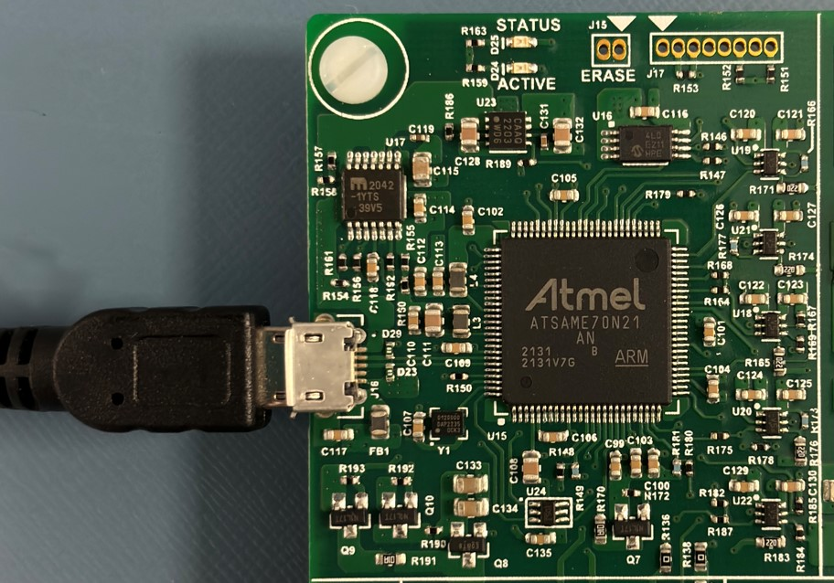

     Alternatively, connect the Microchip programmer/debugger MPLAB® PICkit™ 5 In-Circuit Debugger[(PG164150)](https://www.microchip.com/en-us/development-tool/pg164150) between the Host PC used for programming the device and the **ICSP header J9** on the development board (as shown). Ensure that PICkit 5 is oriented correctly before proceeding.
      

       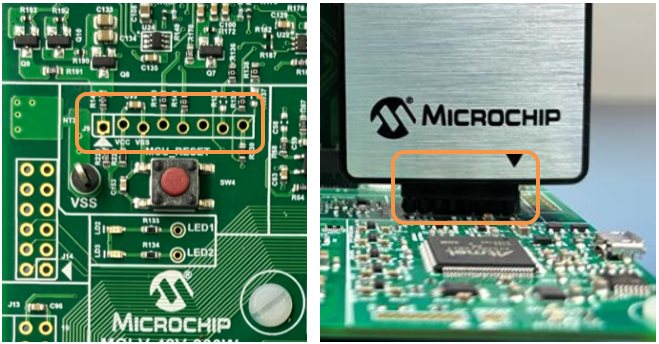

  

## 4. SOFTWARE SETUP AND RUN
### 4.1 Setup: MPLAB X IDE and MPLAB XC-DSC Compiler
Install **MPLAB X IDE** and **MPLAB XC-DSC Compiler** versions that support the device **dsPIC33AK512MC510** and **PKoBv4.** The MPLAB X IDE, MPLAB XC-DSC Compiler, and X2C-Scope plug-in used for testing the firmware are mentioned in the [Motor Control Application Firmware Required for the Demonstration](#21-motor-control-application-firmware-required-for-the-demonstration) section. 

To get help on  

- MPLAB X IDE installation, refer [link](https://microchipdeveloper.com/mplabx:installation)
- MPLAB XC-DSC Compiler installation steps, refer [link](https://developerhelp.microchip.com/xwiki/bin/view/software-tools/xc-dsc/install/)

If MPLAB IDE v8 or earlier is already installed on your computer, then run the MPLAB driver switcher (Installed when MPLAB®X IDE is installed) to switch from MPLAB IDE v8 drivers to MPLAB X IDE drivers. If you have Windows 8 or 10, you must run the MPLAB driver switcher in **Administrator Mode**. To run the Device Driver Switcher GUI application as administrator, right-click on the executable (or desktop icon) and select **Run as Administrator**. For more details, refer to the MPLAB X IDE help topic **“Before You Begin: Install the USB Device Drivers (For Hardware Tools): USB Driver Installation for Windows Operating Systems.”**

### 4.2 Setup: X2C-SCOPE
X2C-Scope is a MPLAB X IDE plugin that allows developers to interact with an application while it runs. X2C-Scope enables you to read, write, and plot global variables (for motor control) in real-time. It communicates with the target using the UART. To use X2C-Scope, the plugin must be installed. To set up and use X2C-Scope, refer to the instructions provided on the [web page](https://x2cscope.github.io/docs/MPLABX_Plugin.html).

## 5.  BASIC DEMONSTRATION
### 5.1 Firmware Description
The firmware version needed for the demonstration is mentioned in the section [Motor Control Application Firmware Required for the Demonstration](#21-motor-control-application-firmware-required-for-the-demonstration). This firmware is implemented to work on Microchip’s Digital Signal Controller (dsPIC® DSC) **dsPIC33AK512MC510**. For more information, see the **dsPIC33AK512MPS512 Family datasheet [(DS70005591)](https://ww1.microchip.com/downloads/aemDocuments/documents/MCU16/ProductDocuments/DataSheets/dsPIC33AK512MPS512-Family-Data-Sheet-DS70005591.pdf)**.

The Motor Control Demo application uses push button **SW1** to start or stop the motor, push button **SW2** to change the direction of rotation of the motor and a potentiometer to vary the speed of the motor. This application configures and uses peripherals like PWM, ADC, OP-AMP, CLC, CCP, CMP, DAC, UART etc.

> **Note:** 
> The project may not build correctly in Windows OS if the Maximum path length of any source file in the project is more than 260 characters. In case the absolute path exceeds or nears the maximum length, do any (or both) of the following:
> - Shorten the directory name containing the firmware used in this demonstration. If you renamed the directory, consider the new name while reading the instructions provided in the upcoming sections of the document.
> - Place firmware in a location such that the total path length of each file included in the projects does not exceed the Maximum Path length specified.  
> Refer to MPLAB X IDE help topic **“Path, File, and Folder Name Restrictions”** for details. 

### 5.2 Basic Demonstration
Follow the below instructions, step by step, to set up and run the motor control demo application:

1. Start **MPLAB X IDE** and open the project **bldc.X (File > Open Project)** with device selection **dsPIC33AK512MC510.**  
    

       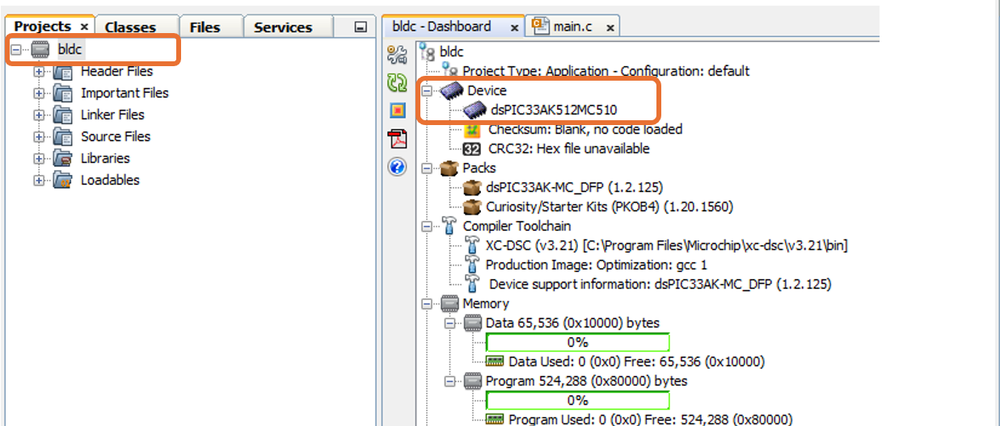

  

2. Set the project **bldc.X** as the main project by right-clicking on the project name and selecting **Set as Main Project** as shown. The project **bldc.X** will then appear in **bold.**
    

     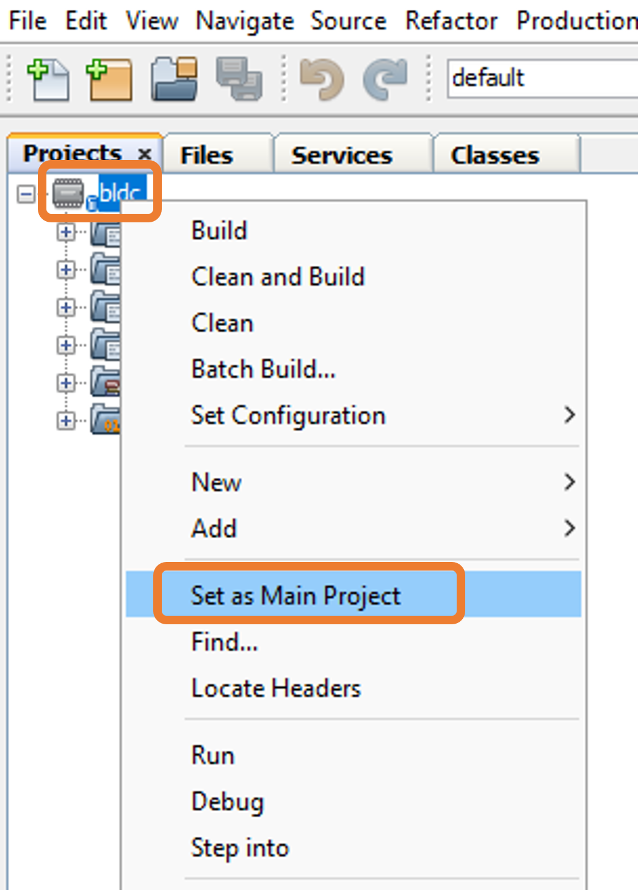

 
3. Open <code>**hall_identifier.h** </code> (**bldc.X > Header Files > hallsensor**) in the project **bldc.X.** 
     - The macro **HALLSEQ_CURRENT_LIMIT_AMPS** is used to limit the current (in Amps) applied to the motor during the Hall sequence identification process.
          
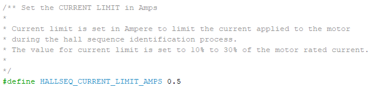

     - The macro **VECTOR_COMMUTATION_INTERVAL** is the  interval between two different voltage vectors applied to the motor to determine hall sequence of the motor. 
          
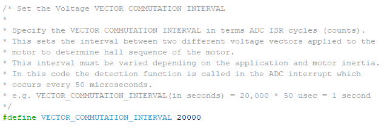

>**Note:** 
> - It is assumed that the  macros <code>HALLSEQ_CURRENT_LIMIT_AMPS</code> and <code>VECTOR_COMMUTATION_INTERVAL</code> are set appropriately for the sequence identification, these values must be varied depending on the application and motor inertia.
> - If a failure is detected during the test, the program will enter fault mode and **faultStatus** will display <code>MCAPP_HALLSEQ_IDENT_FAILURE</code>.
> - The sequence identification for all the Motors are tested under no load conditions. To achieve optimal performance under loaded conditions, the control parameters in the firmware may need additional tuning.

4. Open <code>**mc1_user_params.h** </code> (**bldc.X > Header Files**) in the project **bldc.X.**  
     - Firmware is by default configured to run in closed-loop speed control using a PI controller.
          - **define** the macro to **CLOSED_LOOP 0** to enable open-loop duty control.
          - **define** the macro to **CLOSED_LOOP 1** to enable closed-loop speed control using a PI controller.
          - **define** the macro to **CLOSED_LOOP 2** to enable closed-loop current control using a PI controller.
          
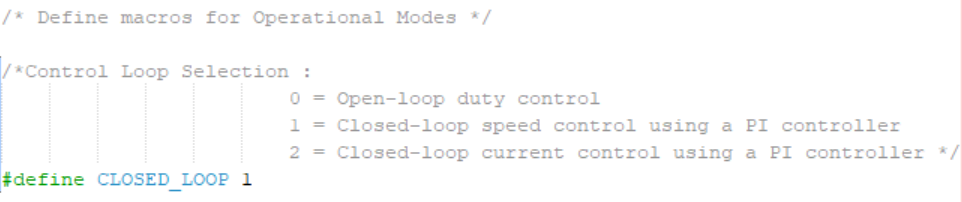

     - Firmware is configured to run with Hurst DMA0204024B101 Motor(Hurst300 or Long Hurst-[AC300022](https://www.microchip.com/en-us/development-tool/AC300022)) by default. 
          - **define** the macro to **MOTOR 2** to run with Hurst DMB0224C10002 Motor(Hurst075 or Short Hurst-[AC300020](https://www.microchip.com/en-us/development-tool/AC300020)). 
          - **define** the macro to **MOTOR 3** to run with ACT 57BLF02 Brushless DC Motor [(57BLF02)](https://www.act-motor.com/brushless-dc-motor-57blf-product/).
          - **define** the macro to **MOTOR 4** to run with Leadshine Servo Motor [(ELVM6020V24FH-B25-HD)](https://www.leadshine.com/product-detail/ELVM6020V24FH-B25-HD.html). 
          - All the Motors are tested under no load conditions. To achieve optimal performance under loaded conditions, the control parameters in the firmware may need additional tuning.
          
 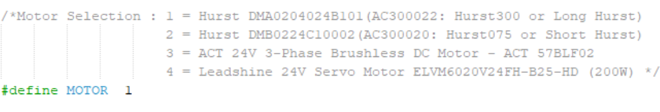

     - When internal amplifiers are used for current amplification (referred to as **internal op-amp configuration**), **define** the macro <code>**INTERNAL_OPAMP_CONFIG**</code>
          
 

     - Otherwise, if external amplifiers are used for current amplification (referred to as **external op-amp configuration**), **undefine** the macro <code>**INTERNAL_OPAMP_CONFIG**</code>
        

 

5. Right-click on the project **bldc.X** and select **Properties** to open its **Project Properties** Dialog. Click the **Conf:[default]** category to reveal the general project configuration information. The development tools used for testing the firmware are listed in section [2.2 Software Tools Used for Testing the firmware.](#22-software-tools-used-for-testing-the-firmware)

     In the **Conf:[default]** category window: 
     - Ensure the selected **Device** is **dsPIC33AK512MC510.**
     - Select the **Connected Hardware Tool** to be used for programming and debugging. 
     - Select the specific Device Family Pack (DFP) from the available list of **Packs.** In this case, **dsPIC33AK-MC_DFP 1.2.125** is selected. 
     - Select the specific **Compiler Toolchain** from the available list of **XC-DSC** compilers. 
     In this case, **XC-DSC(v3.21)** is selected.
     - After selecting Hardware Tool and Compiler Toolchain, Device Pack, click the button **Apply**

     Please ensure that the selected MPLAB® XC-DSC Compiler and Device Pack support the device configured in the firmware

     

     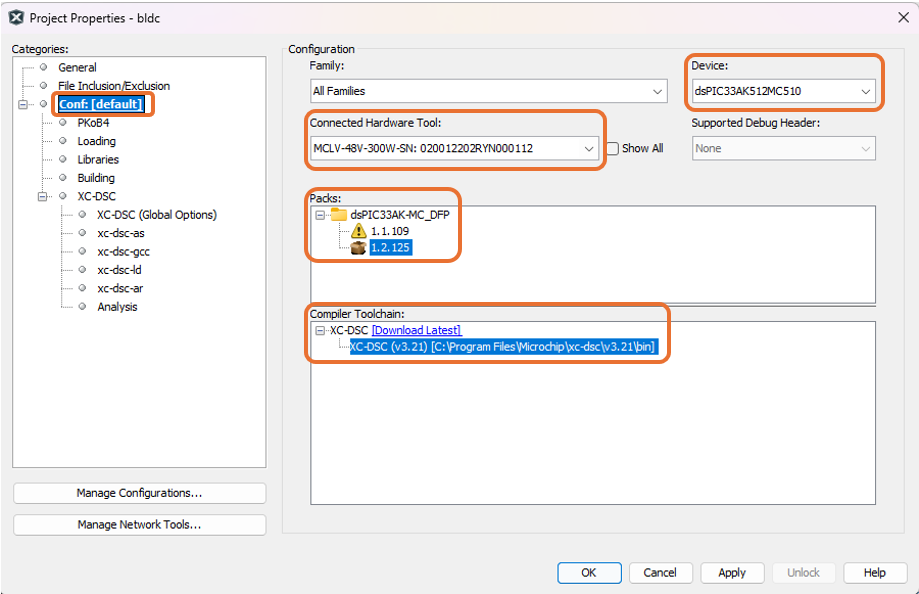

6. Ensure that the checkbox **Load symbols when programming or building for production (slows process)** is checked under the **Loading** category of the **Project Properties** window.       
        
      

      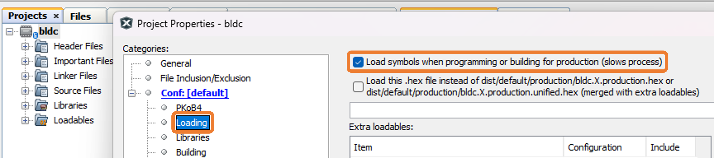

     Also, go to **Tools > Options** , and
           
      

      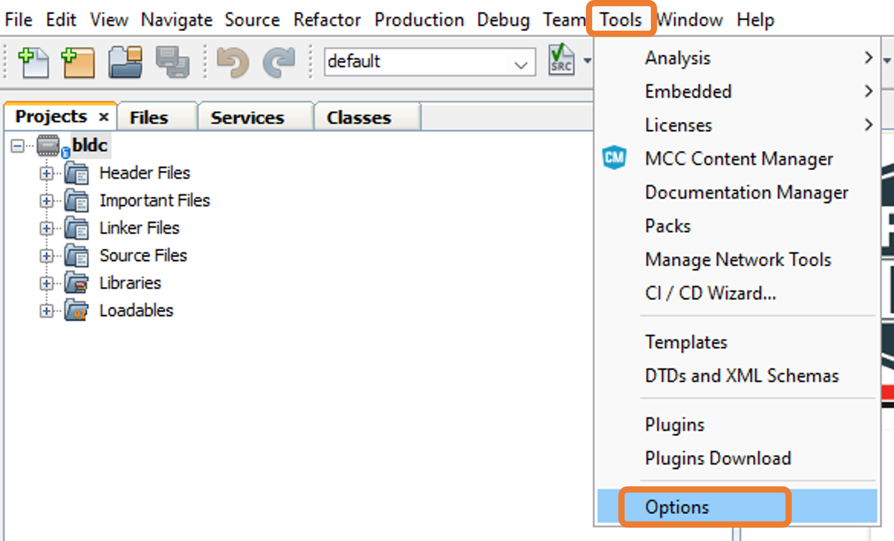

      
    Open the  **Embedded > Generic Settings** tab and ensure that the **ELF debug session symbol load methodology (MIPS/ARM)** is selected as **Pre-procesed (Legacy)** from the drop down.
           
      

      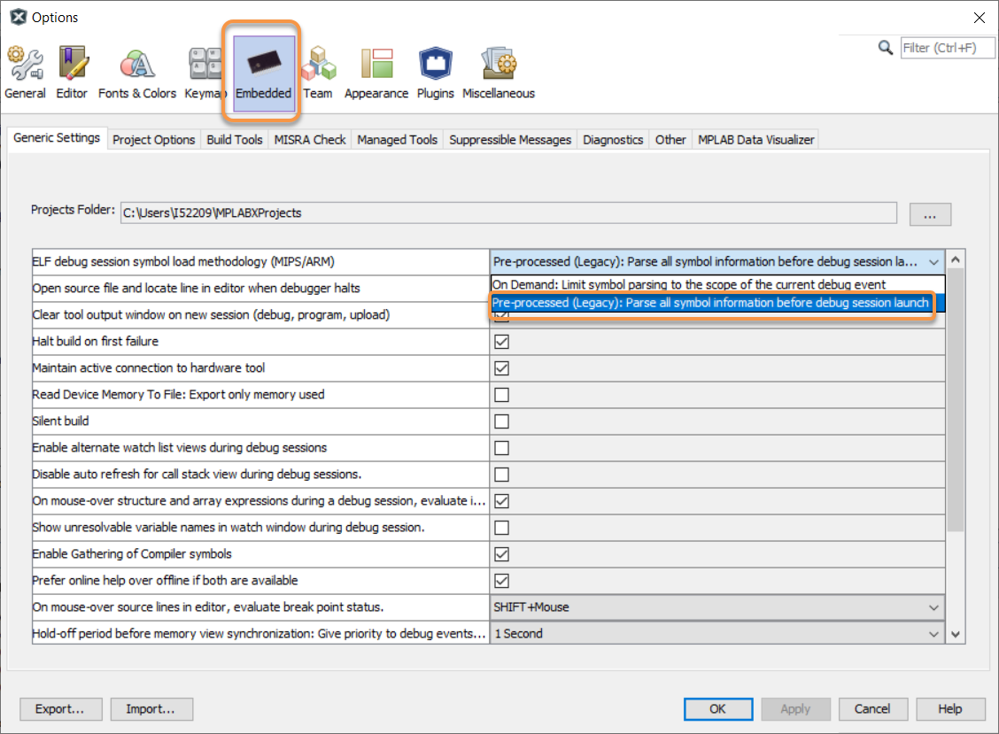

7. To build the project (in this case, **bldc.X**) and program the device dsPIC33AK512MC510, click **Make and Program Device Main project** on the toolbar
    

    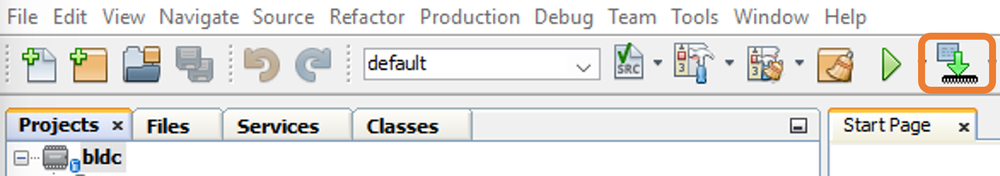

  
8. If the device is successfully programmed, **LED1 (LD2)** will be **blinking**, indicating that the dsPIC® DSC is enabled.
    

     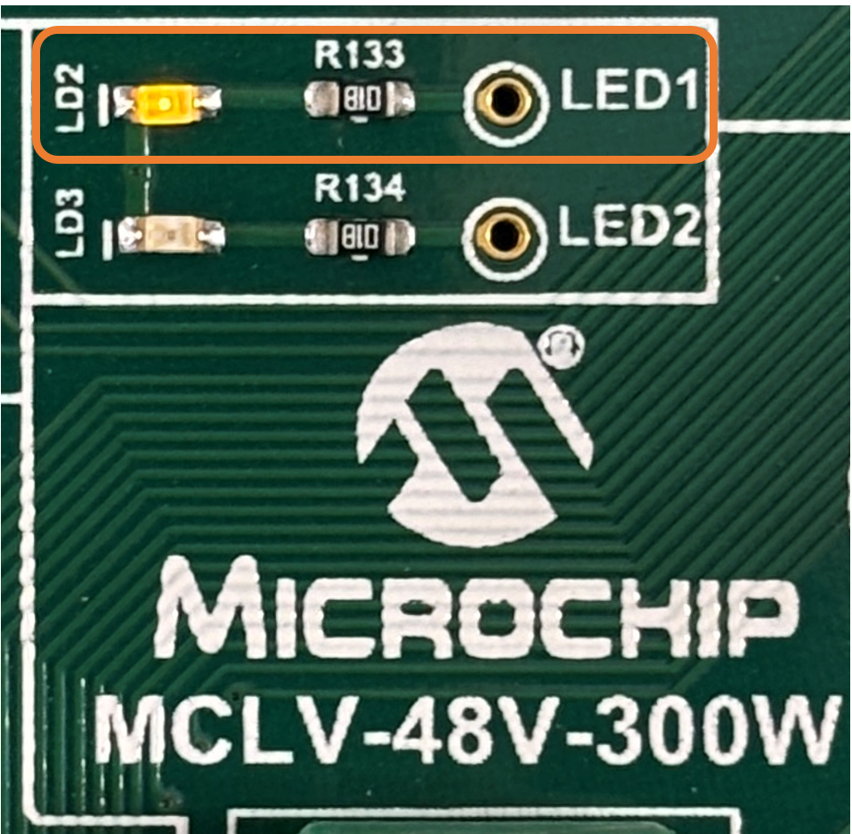

9. The Hall sequence identifier executes to determine the correct hall sensor pattern and load the corresponding inverter switching sequence. The motor starts running only after the test is complete, and this process occurs only once during power-on or MCU reset. 

10. Run or stop the motor by pressing the push button **SW1.** The motor should start spinning smoothly in one direction in the nominal speed range. Ensure that the motor is spinning smoothly without any vibration. The **LED2 (LD3)** is turned **ON** to show that the button has been pressed to start the motor. The specific motor was tested under no load conditions. To achieve optimal performance under loaded conditions, the control parameters in the firmware may need additional tuning.
     

     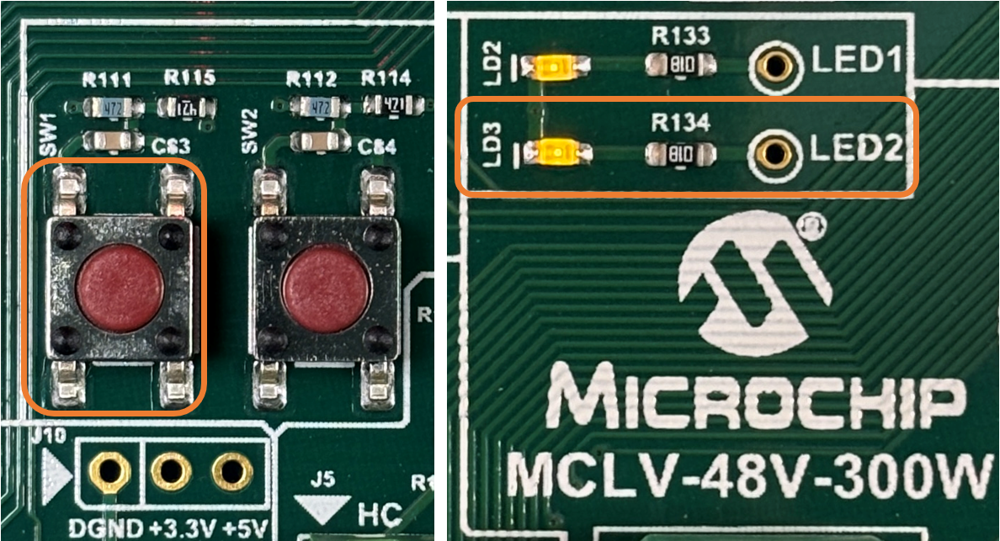

 
11. The motor speed can be varied using the potentiometer **(POT1).**
    

    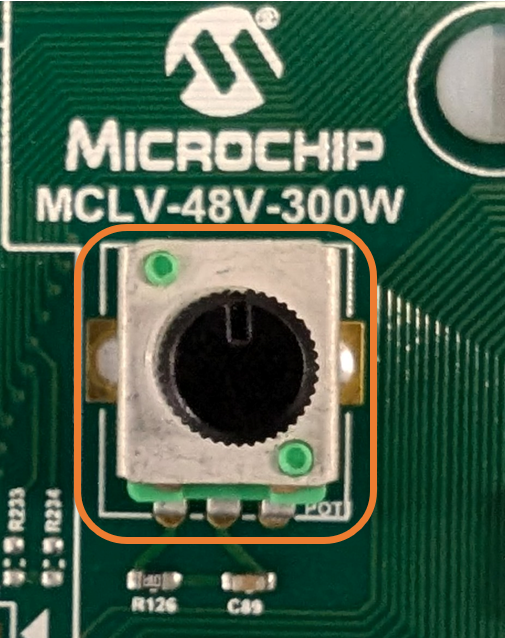

 
12. Press the push button **SW2** to change the direction of rotation of the motor.
     

     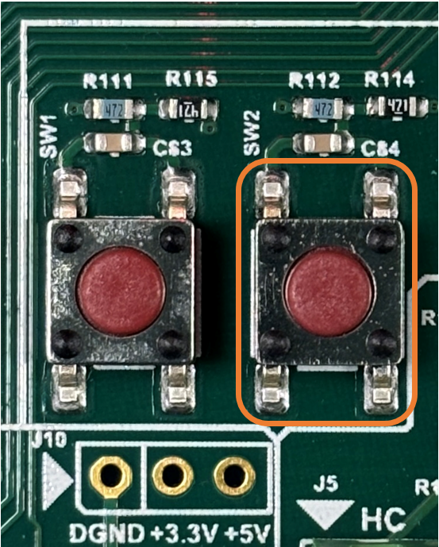
 

13. Press the push button **SW1** to stop the motor.

>**Note:** 
>The macros <code>POLE_PAIRS</code>, <code>MINIMUM_SPEED_RPM</code>, <code>MAXIMUM_SPEED_RPM</code>, <code>DIRECTION_CHANGE_SPEED_RPM</code>, and <code>NOMINAL_CURRENT_BUS_RMS</code> are defined in the respective motor header files. Exceeding manufacture's specifications may damage the motor or the board or both.

## 5.3  Data visualization through X2C-Scope Plug-in of MPLAB X

X2C-Scope is a third-party plug-in in MPLAB X, which helps in real-time diagnostics. The application firmware comes with the initialization needed to interface the controller with the host PC to enable data visualization through the X2C-Scope plug-in. Ensure the X2C-Scope plug-in is installed. For more information on how to set up a plug-in, refer to either the [Microchip Developer Help page](https://microchipdeveloper.com/mplabx:tools-plugins-available) or the [web page.](https://x2cscope.github.io/docs/MPLABX_Plugin.html)
 
1. To establish serial communication with the host PC, connect a micro-USB cable between the host PC and **connector J16** on the development board. This interface is also used for programming.

2. Ensure the application is configured and running as described under section [5.2 Basic Demonstration](#52-basic-demonstration) by following steps 1 through 12.

3. Open the **X2C-Scope** window by selecting **Tools>Embedded>X2CScope.**
      

       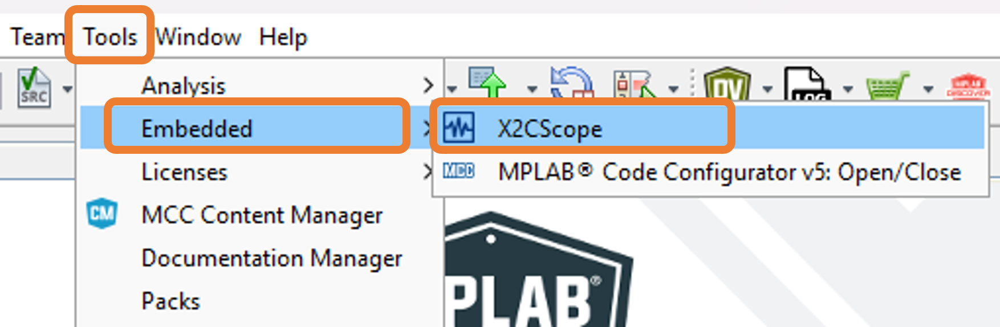

 

4. **In the X2C-Scope Configuration** window, open the **Connection Setup** tab and click **Select Project.** This opens the drop-down menu **Select Project** with a list of opened projects. Select the specific project **bldc** from the list of projects and click **OK.**
    

    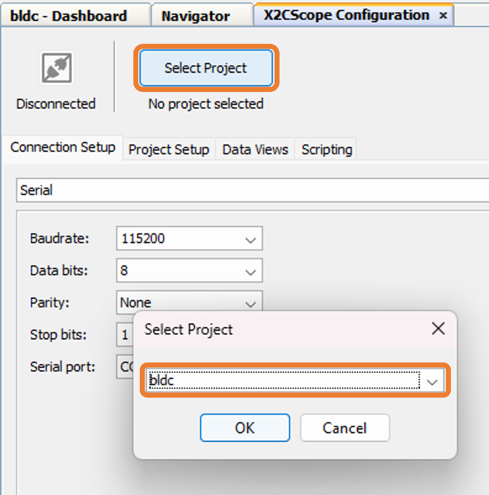

5. To configure and establish the serial communication for **X2C-Scope**, open the **X2CScope Configuration** window, click on the **Connection Setup** tab and:
     - Set **Baudrate** as **115200**, which is configured in the application firmware. 
     - Click on the **Refresh** button to refresh and update the list of the available Serial COM ports connected to the Host PC. 
     - Select the specific **Serial port** detected when interfaced with the development board. The **Serial port** depends on the system settings

    

     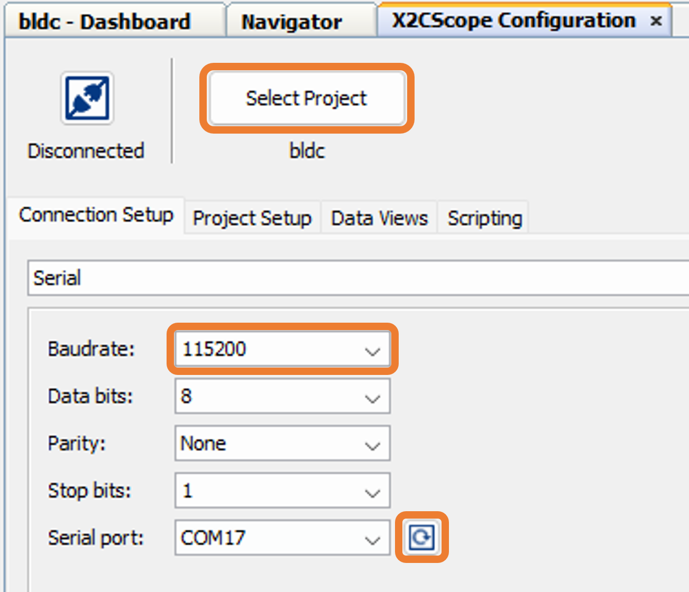

 

6. Once the **Serial port** is detected, click on **Disconnected** and turn to **Connected**, to establish serial communication between the Host PC and the board.
     

    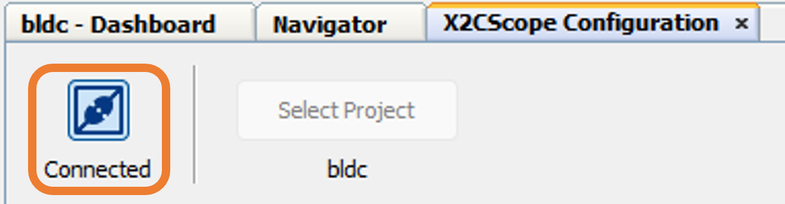

7. Open the **Project Setup** tab in the **X2CScope Configuration** window and,
     - Set **Scope Sampletime** as the interval at which <code>X2CScopeUpdate()</code> is called. In this application, it is every <code>50µs.</code> 
     - Then, click **Set Values** to save the configuration.

      

      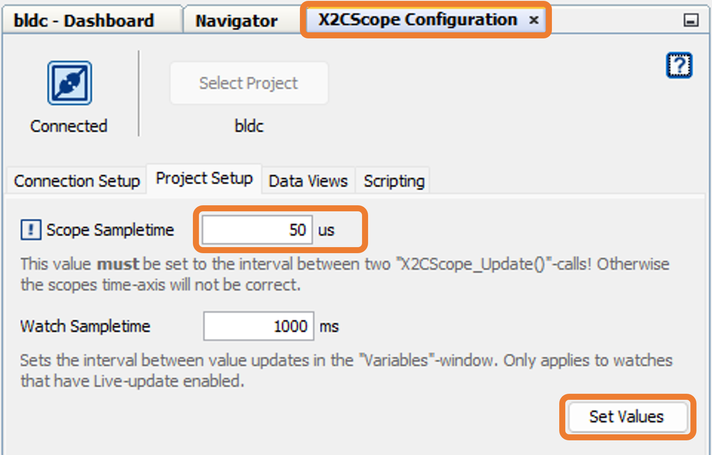

8.	Click on **Open Scope View** (in the **Data Views** tab of the **X2CScope Configuration** Window); this opens **Scope Window.**
     

      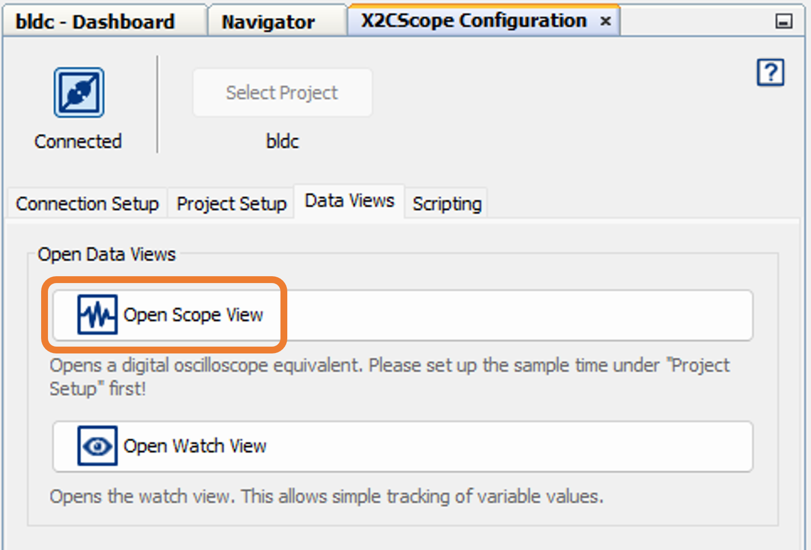

    	     
9. In the **Scope Window**, select the variables that must be watched. To do this, click on the **Source** against each channel, and a window **Select Variables** opens on the screen. From the available list, the required variable can be chosen. Ensure checkboxes **Enable** and **Visible** are checked for the variables to be plotted.
To view data plots continuously, uncheck **Single-shot.** When **Single-shot** is checked, it captures the data once and stops. The **Sample time factor** value multiplied by **Sample time** decides the time difference between any two consecutive data points on the plot.
    

    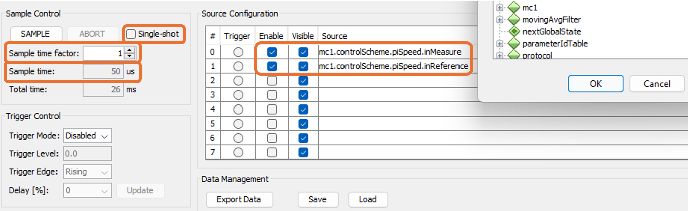

10.	Click on **SAMPLE**, then the X2C-Scope window plots variables in real-time, which updates automatically.
     

     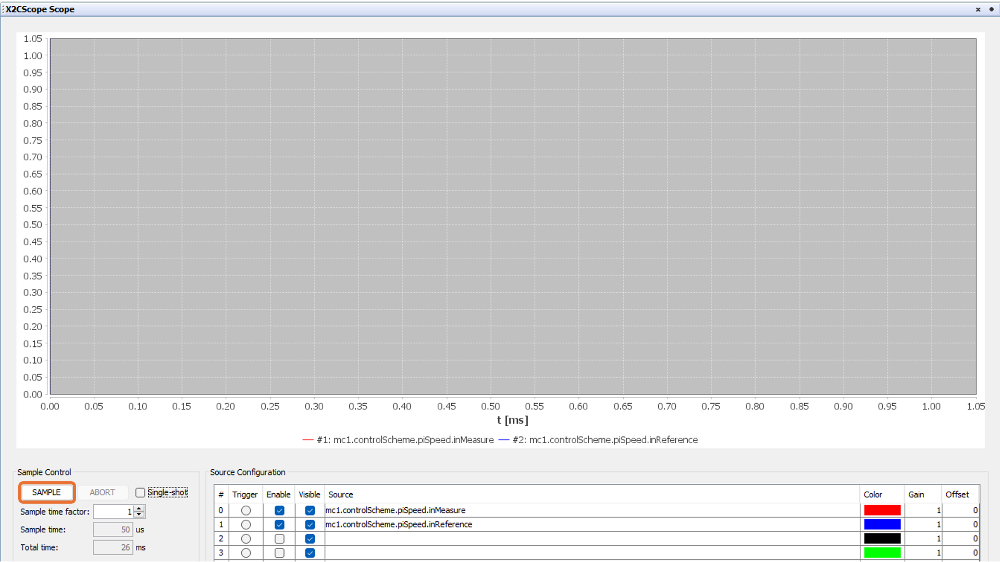

 

11.	Click on **ABORT** to stop.
     

     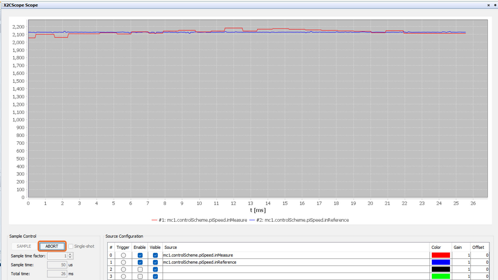

 
 ## 6. REFERENCES:
For additional information, refer following documents or links.
1. AN957 Application Note ["Sensored BLDC Motor Control Using dsPIC30F2010"](https://ww1.microchip.com/downloads/aemDocuments/documents/OTH/ApplicationNotes/ApplicationNotes/BLDCMC00957a.pdf)
2. MCLV-48V-300W Development Board User’s Guide [(DS50003297)](https://ww1.microchip.com/downloads/aemDocuments/documents/MCU16/ProductDocuments/UserGuides/Motor-Control-Low-Voltage-48V-300W-Inverter-Board-Users-Guide-DS50003297.pdf)
3. dsPIC33AK512MC510 Motor Control Dual In-Line Module (DIM) Information Sheet [(DS70005553)](https://ww1.microchip.com/downloads/aemDocuments/documents/MCU16/ProductDocuments/InformationSheet/dsPIC33AK512MC510-Motor-Control-Dual-In-Line-Module-Information-Sheet-DS70005553.pdf)
4. dsPIC33AK512MPS512 Family datasheet [(DS70005591)](https://ww1.microchip.com/downloads/aemDocuments/documents/MCU16/ProductDocuments/DataSheets/dsPIC33AK512MPS512-Family-Data-Sheet-DS70005591.pdf)
5. MPLAB® X IDE User’s Guide [(DS50002027)](https://ww1.microchip.com/downloads/en/DeviceDoc/50002027E.pdf) or [MPLAB® X IDE help](https://microchipdeveloper.com/xwiki/bin/view/software-tools/x/)
6. [MPLAB® X IDE installation](http://microchipdeveloper.com/mplabx:installation)
7. [MPLAB® XC-DSC Compiler installation](https://developerhelp.microchip.com/xwiki/bin/view/software-tools/xc-dsc/install/)
8. [Installation and setup of X2Cscope plugin for MPLAB X](https://x2cscope.github.io/docs/MPLABX_Plugin.html)
9. [Microchip Packs Repository](https://packs.download.microchip.com/)
10. [Programming and Debugging the dsPIC33A on MPLAB X IDE v6.20 and IPE v6.20](https://developerhelp.microchip.com/xwiki/bin/view/software-tools/ides/x/)

 ## 7. APPENDIX
 The CLC and SCCP peripherals of the dsPIC are configured to detect sector transitions from the Hall sensors and to measure speed. The CLC is set up to generate a pulse train based on the Gray code pattern obtained from the combination of three Hall sensors. The period of this pulse train can be measured using the input capture and timer features of the SCCP module. The configuration of the CLC peripheral for generating a pulse train from the Hall sensor Gray code is illustrated in the figure below.
     

     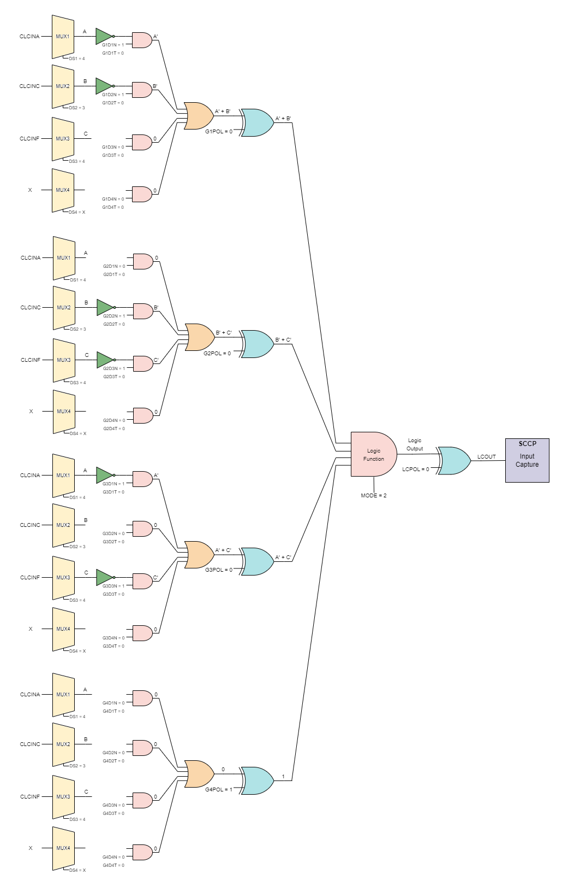

The figure given below illustrates the pulse train output of the CLC in response to changes in the Hall sensor input.

     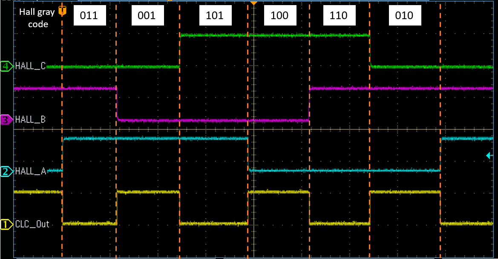

